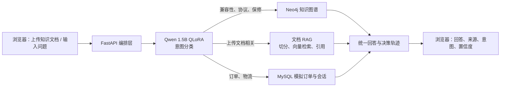

# LoRA × 知识图谱 × RAG 智能客服工作台：实现设计

> 本文档取代 `2026-06-25-fragment-aware-customer-agent-design.md` 的实现范围。旧文档仅保留为早期方案记录；后续开发只能以本文档为准。

## 1. 做什么、展示什么

构建一个可在浏览器中演示的“智能家居客服工作台”。它不复刻任何公司的系统，不使用任何公司资料，而是使用虚构产品、订单与售后政策，完成一条完整的客服链路：



演示时必须让浏览者看见，而不是只听你说：

1. 上传一份虚构的 PDF/DOCX 售后政策或产品说明书；
2. 在聊天窗口提问，获得带文档页码/片段引用的回答；
3. 提问产品兼容性问题，获得标注“知识图谱”的商品关系卡片；
4. 打开“模型评测”页，看到 Qwen zero-shot 与 QLoRA Adapter 的 Accuracy、Macro-F1、混淆矩阵与错误样例；
5. 刷新页面后，仍能在会话列表看到 MySQL 保存的历史对话。

## 2. 本次范围

### 必须完成

- 自建 React + Vite + TypeScript 前端：会话列表、聊天、文件上传、来源卡片、决策轨迹侧栏、模型评测页。
- FastAPI 后端：上传、聊天、会话历史、训练指标读取四类 API。
- `Qwen2.5-1.5B-Instruct` 的 4-bit QLoRA 意图微调，以及与 zero-shot 基线的对照评测。
- Neo4j 小型商品图谱：兼容性、支持协议、保修政策三类参数化只读查询。
- 文档 RAG：PDF/DOCX 文本解析、切块、`BAAI/bge-small-zh-v1.5` 向量化、Chroma 本地持久化、回答引用。
- MySQL：用户会话、对话消息、上传文档元数据、索引状态。
- Docker Compose：MySQL 与 Neo4j；后端和前端均可本地启动。
- 测试、README、架构图、演示数据和录屏脚本。

### 本次不做

- 不复现 Microsoft GraphRAG 的社区报告、global/local search 等完整管线；项目名称只能称为“知识图谱增强 RAG”，不能声称实现了完整 GraphRAG。
- 不做联网搜索、JWT 登录注册、Redis 缓存、图片识别、多租户权限、消息捏合或生产部署。
- 不使用真实公司知识库、客服记录、业务指标、员工账号、API 密钥或内部提示词。

这些不是“做不到”，而是展示项目中与 LoRA、图谱、RAG、前后端和数据库无直接关系的功能。完成本文档后再加。

## 3. 技术选型与模块边界

| 层级 | 技术 | 责任 |
|---|---|---|
| 前端 | React、Vite、TypeScript、Tailwind CSS、Recharts | 演示界面、聊天、上传、轨迹和评测可视化 |
| API | FastAPI、Pydantic、SQLAlchemy | 输入校验、编排、数据库读写、统一响应 |
| 微调 | Transformers、PEFT、bitsandbytes、TRL | QLoRA 训练、基线/Adapter 评测、推理 |
| 图谱 | Neo4j 5 Docker、官方 Python Driver | 商品关系事实与参数化 Cypher 查询 |
| 文档 RAG | PyMuPDF、python-docx、Chroma、bge-small-zh-v1.5 | 文件解析、分块、向量索引、引用检索 |
| 关系数据库 | MySQL 8 Docker | 会话、消息、文档元数据、索引状态 |

### 微调模型

Qwen 不是从头训练，而是加载 `Qwen2.5-1.5B-Instruct` 后训练一个 LoRA Adapter。输入是客服问题，输出必须是如下 JSON：

```json
{"intent":"compatibility","confidence":0.92}
```

固定八个标签：

```text
product_consultation
compatibility
order_status
shipping
return_refund
warranty_fault
complaint
human_handoff
```

训练配置固定为：4-bit NF4 量化，LoRA `r=16`、`alpha=32`、`dropout=0.05`，目标层为 `q_proj`、`k_proj`、`v_proj`、`o_proj`、`gate_proj`、`up_proj`、`down_proj`。每个标签准备 90 条训练、20 条验证、20 条测试语句；测试集必须人工改写，不能是训练样本的近似重复。训练数据可以由 AI 协助生成，但你必须每类抽查至少 15 条，改正不符合客服常识、标签混乱或包含真实公司信息的句子。

### 知识图谱

使用虚构品牌“智家”。节点为 `Product`、`Protocol`、`Accessory`、`Policy`，关系为 `SUPPORTS`、`COMPATIBLE_WITH`、`REQUIRES`、`COVERED_BY`。只实现以下三类白名单查询：

1. 两个商品或配件是否兼容；
2. 某商品支持哪些协议；
3. 某商品适用什么保修政策。

LLM 不得自由生成 Cypher。后端先从已识别的产品名中做白名单匹配，再以参数传入固定 Cypher 模板。

### 文档 RAG

上传文件后，后端校验扩展名为 `.pdf` 或 `.docx`、限制单文件 10MB；提取文本后按 500 汉字、80 汉字重叠切块。每一块保存 `document_id`、页码或段落号、原始文本。检索前 4 块，回答必须返回引用数组，例如：

```json
{
  "source_type":"document_rag",
  "sources":[{"document_name":"智家保修政策.pdf","location":"第 2 页","snippet":"…"}]
}
```

本版本可以用模板将检索事实组织成回答；若接入大模型生成，必须把引用文本一并传入，并明确要求“缺乏依据时回答不知道”。

### MySQL 会话历史

表设计只保留四张：`conversations`、`messages`、`documents`、`document_indexes`。前端加载会话列表，点击会话可以读取完整消息。无需登录系统；演示用固定 `demo_user_id=1`。

## 4. API 契约

| 接口 | 职责 |
|---|---|
| `POST /api/documents` | 上传 PDF/DOCX，创建 MySQL 元数据并构建 Chroma 索引 |
| `POST /api/conversations` | 创建空会话 |
| `GET /api/conversations` | 获取会话列表 |
| `GET /api/conversations/{id}/messages` | 获取消息历史 |
| `POST /api/conversations/{id}/chat` | 意图识别、路由图谱/RAG/订单工具、保存并返回回答 |
| `GET /api/evaluation` | 返回 baseline 与 Adapter 的评测指标和错误样例 |

`POST /api/conversations/{id}/chat` 的响应必须包括：

```json
{
  "answer":"Cam-A1 可与 Hub-Z1 配合使用。",
  "intent":"compatibility",
  "confidence":0.92,
  "source_type":"knowledge_graph",
  "sources":["Cam-A1 COMPATIBLE_WITH Hub-Z1"],
  "handoff_required":false
}
```

置信度低于 `0.70`、标签为 `complaint` 或 `human_handoff` 时，返回 `handoff_required=true`；页面将其显示为“建议人工跟进”。

## 5. 前端展示设计

页面不需要模仿原项目。它应当看起来像你自己的客服工作台：

- `/`：左栏会话列表；中栏聊天与上传按钮；右栏“本次决策轨迹”。
- 决策轨迹固定显示：意图标签、置信度、路由名称、来源卡片、人工跟进标记。
- 来源卡片：文档来源显示文件名、页码和片段；图谱来源显示关系三元组。
- `/evaluation`：两张指标卡、baseline/LoRA 对比柱状图、混淆矩阵表和三条错误样例。

前端必须覆盖这三段演示：上传保修政策后追问退货规则；询问 Cam-A1 与 Hub-Z1 是否兼容；询问无法判断的投诉/模糊问题并看到人工跟进提示。

## 6. 推荐目录

```text
customer-intelligence-workbench/
├── README.md
├── .gitignore
├── .env.example
├── docker-compose.yml
├── backend/
│   ├── requirements.txt
│   ├── app/
│   │   ├── main.py
│   │   ├── api/
│   │   ├── models/
│   │   ├── services/
│   │   │   ├── classifier.py
│   │   │   ├── graph_service.py
│   │   │   ├── rag_service.py
│   │   │   ├── chat_orchestrator.py
│   │   │   └── document_service.py
│   │   └── schemas/
│   ├── data/
│   └── tests/
├── frontend/
│   └── src/
├── training/
│   ├── train_qlora.py
│   ├── evaluate.py
│   ├── evaluate_zero_shot.py
│   ├── data/
│   └── reports/
├── graph/
│   └── seed.cypher
└── scripts/
    ├── seed_demo_data.py
    └── demo.py
```

## 7. 推进方式：谁做什么

你不是“把任务扔给 AI 的人”，而是项目负责人和验收者。每一步只让一个代码工具做一个模块；完成后你必须自己运行一次、看一次界面或输出、问一次它为什么这样设计。

推荐分工是：Codex 负责架构、集成、审查和文档；Claude Code CLI 负责在项目目录里按模块写代码、跑测试、根据失败日志迭代；GPT/ChatGPT 负责解释、讨论、生成思路和模拟面试；你负责最终判断、手动运行、云平台和演示验收。

| 工作 | Codex | Claude Code CLI | 你手动操作 | GPT/ChatGPT 协助 |
|---|---|---|---|---|
| 项目脚手架、Docker、前后端代码、测试 | 拆模块、审查目录边界、做最终集成 | 主责落地单模块代码、运行测试、修复失败 | 看文件树、运行命令、确认未覆盖文件 | 解释术语和代码取舍 |
| 意图 taxonomy 与数据 | 设计标签边界、检查数据泄漏和评测口径 | 生成 JSONL、写数据校验脚本和评测读取代码 | 审核每类 15 条、改写独立测试集 | 生成边界案例、讨论标签冲突 |
| Neo4j 图谱 | 定义图谱范围、审查 Cypher 是否白名单化 | 写 Docker、Cypher、GraphService 查询与测试 | 在 Browser 中查看节点关系、手动验证三条查询 | 帮你理解图模型与 Cypher |
| RAG | 审查切分、引用、缺证回答和测试覆盖 | 写解析、切分、检索、引用和 API 测试 | 上传一份虚构文档，检查引用是否真的支持答案 | 帮你审查“回答是否有依据” |
| 云 GPU | 给出环境检测、训练、评测命令并审查日志 | 整理 training 脚本、README 命令和失败排查清单 | 注册/付费、创建实例、配置 SSH、运行命令、关机 | 解释 CUDA、显存、训练日志 |
| 前端展示 | 审查 API 契约、演示链路和视觉一致性 | 实现 UI、状态流、Mock 切换、真实 API 接入 | 在浏览器验收、挑选页面文案、录屏截图 | 讨论交互与演示脚本 |
| 最终验收 | 主责逐项审计、修集成问题、更新 README | 按明确失败项修 bug、补测试、贴命令输出 | 运行全链路、录屏、确认没有密钥和真实公司信息 | 帮你把真实结果改成简历和面试表达 |
| 简历和面试 | 根据真实日志生成技术描述初稿 | 不主责，除非需要从仓库提取实际产物清单 | 只保留真实完成的内容、练习讲述 | 追问模拟与表达修改 |

### Claude Code CLI 使用边界

Claude Code CLI 可以写代码，但不要让它替你决定项目范围。每次进入项目目录后，只给它一个模块任务，并要求它先读取本文档、运行 `git status --short`、说明准备修改的文件、完成后运行测试并汇报真实输出。

Claude Code CLI 适合处理：

- 目录脚手架、后端服务、前端组件、测试、脚本和 README 的具体实现；
- 根据报错日志做小步修复；
- 把 Codex 已经定下来的 API 契约和模块边界落成代码。

Claude Code CLI 不负责：

- 改变本文档定义的项目范围；
- 宣称训练完成或编造 Accuracy、Macro-F1 等指标；
- 接触密码、Token、私钥、付款信息；
- 自行加入鉴权、Redis、联网搜索、真实企业数据或完整 GraphRAG。

### 你在云 GPU 平台必须亲自做的事

1. 创建 Linux GPU 实例：Ubuntu 22.04、至少 16GB 显存、推荐 24GB、磁盘至少 30GB。
2. 只在平台控制台保存付款信息、SSH 密钥和登录凭据；绝不把密码、Token 或私钥发到聊天中。
3. 通过 SSH 连接，确认 `nvidia-smi` 能显示 GPU；将结果复制给 Codex 或 Claude Code CLI。
4. 由 Codex 或 Claude Code CLI 给出训练命令后，你亲自执行并保存终端日志、Adapter、评测 JSON 和图表。
5. 下载产物后在平台控制台停止实例，避免继续计费。

## 8. 交给 Codex / Claude Code CLI 的提示词模板

每次只复制一个提示词；在当前工具完成并通过验收前，不要让它跳到下一个模块。

给 Codex 时，优先用于设计拆分、代码审查、集成修复和最终验收。给 Claude Code CLI 时，优先用于在本地项目目录中实现单个模块、运行测试、根据失败日志修复。若你同时使用两者，顺序建议为：Codex 定边界和验收标准，Claude Code CLI 写模块代码，Codex 再审查集成结果。

### 0. 通用协作规则

```text
当前项目必须遵循 docs/superpowers/specs/2026-06-25-customer-workbench-design.md。
本次只做我指定的一个模块；不要自行增加鉴权、Redis、联网搜索、图片识别、GraphRAG、消息捏合或真实企业数据。
动手前先读取本文档和当前目录结构，运行 git status --short，并用不超过 8 条说明将修改的文件、数据流、运行命令和验收方式告诉我。
除非我明确要求，不要修改本文档本身。
完成后运行测试并用中文解释每个核心文件的责任。任何指标都必须来自实际命令输出，不能编造。
```

### 1. 基础工程

```text
读取设计文档后，在当前工作区建立 customer-intelligence-workbench 的空项目。创建 React/Vite/TypeScript 前端、FastAPI 后端、training、graph、scripts 和测试目录；提供 MySQL 8 与 Neo4j 5 的 docker-compose.yml、.env.example、.gitignore 和 README。不要实现业务功能。完成后启动两个数据库容器并显示健康检查结果。
```

### 2. 数据与知识图谱

```text
只实现虚构的“智家”商品数据和 Neo4j 图谱。创建 graph/seed.cypher、参数化 GraphService、兼容性/协议/保修三类白名单查询及测试。禁止 LLM 生成任意 Cypher。完成后启动数据库、播种数据、运行测试，并逐条展示查询输入、Cypher 模板和结果。
```

### 3. 文件上传与 RAG

```text
只实现 FastAPI 的 PDF/DOCX 上传、10MB 和扩展名校验、文本提取、500 字/80 字重叠切块、bge-small-zh-v1.5 向量化、Chroma 持久化检索与引用返回。用 MySQL 保存 document 和 index 元数据；先写失败测试，再实现。不要接 Qwen、Neo4j 或前端。完成后用虚构保修政策文件演示带页码引用的检索结果。
```

### 4. QLoRA 训练与评测

```text
只实现 training 模块：为八类固定意图创建互不泄漏的 train/validation/test JSONL，使用 Qwen2.5-1.5B-Instruct 做 zero-shot 基线和 4-bit QLoRA Adapter 训练，输出 Accuracy、Macro-F1、混淆矩阵和错误样例。给出云 GPU 所需的完整命令、环境检测和预期文件，不得声称训练已完成或编造指标。若 1.5B 无法在可用显存运行，改用 Qwen2.5-0.5B 的 QLoRA 并在报告说明原因。
```

### 5. 编排与 MySQL 会话

```text
只实现 FastAPI 会话、消息、文档、索引四个 MySQL 模型，以及 ChatOrchestrator。它应先调用 Adapter 分类器，再按 intent 路由到 GraphService、RAG 服务或本地订单/规则服务，保存会话消息，并返回 answer、intent、confidence、source_type、sources、handoff_required。先写 API 和路由测试，覆盖低置信度、图谱、文档引用和会话持久化；然后实现最小代码。
```

### 6. 前端工作台

```text
只实现 React 工作台：左栏会话列表，中栏聊天和 PDF/DOCX 上传，右栏决策轨迹，另建 /evaluation 页展示 baseline 与 LoRA 的指标对比、混淆矩阵和错误样例。使用设计文档中的 API 契约；先用 Mock 数据完成界面与状态，再接真实 FastAPI。完成后运行前端，并告诉我三个演示场景在浏览器里的具体操作。
```

### 7. 最终验收

```text
逐条审计设计文档的“必须完成”项：运行后端测试、前端构建、Docker Compose 健康检查、三段浏览器演示和评测报告读取。检查仓库中没有密钥、真实公司信息或未实际运行却写入 README 的指标。修复明确问题后更新 README，写清启动、训练、演示、局限和产物位置。
```

## 9. 真实演示与简历边界

演示只讲实际完成的模块。若 Adapter 训练完成但前端使用的是 mock 指标，必须在 README 标明，不能把 mock 数字写进简历。若图谱查询使用虚构数据，应说“构建了智能家居领域的模拟知识图谱”，而不是“接入企业商品库”。

完成且有真实结果后，简历可写：

> 构建知识图谱增强的智能客服工作台：基于 Qwen2.5-1.5B 的 QLoRA Adapter 完成 8 类客服意图路由，并与 zero-shot 基线进行 Accuracy/Macro-F1 对照；实现 PDF/DOCX 知识库上传与引用式 RAG、Neo4j 商品兼容性查询及 MySQL 会话持久化，在 React 可视化界面展示模型决策轨迹与人工转接兜底。

模型规格、样本数、指标和界面能力必须按实际产物替换。
